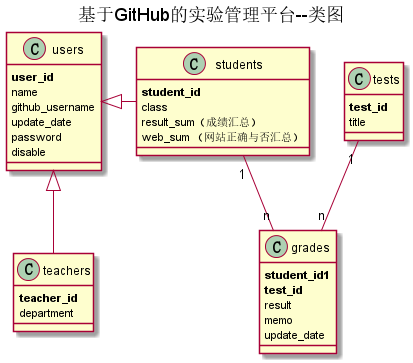

<!-- markdownlint-disable MD033-->
<!-- 禁止MD033类型的警告 https://www.npmjs.com/package/markdownlint -->

# 《信息系统分析与设计》（第4版）

清华大学出版社 王晓敏 邝孔武 编著

主讲：成都大学信息科学与工程学院 赵卫东

## 老师编写的基于GitHub的实验管理平台
- 查看与修改你的GitHub用户名：http://202.115.82.8:1522
- 源码参见: https://github.com/zwdbox/is_analysis/tree/master/项目/实验平台
- 注意，查询个人成绩界面中不要出现下图中的“错误地址”，否则会没有成绩。
  
  
## 搭建文档编写环境：
- 编辑器: IntelliJ IDEA
- IDEA插件: markdown 和 plantuml
- 单独安装: git 和 graphviz

## 实验

- ### [实验1：业务流程建模](./test1.md)
    - 实验1批改情况说明（大家都容易出现的问题有）：
        1. 没有按角色分组
        2. 没有文字说明
    - 本实验部分比较优秀(95分以上)的同学如下：    
        - [郭钊彬	软件(本)15-1](https://github.com/HaveyouBinbin/is_analysis/tree/master/test1)
        - [姚启迪	软件(本)15-1](https://github.com/Konoha-Y/is_analysis/tree/master/test1)
        - [曾玉龙	软件(本)15-2](https://github.com/Zengyulong/is_analysis/tree/master/test1)
        - [陈惠翔	软件(本)15-4](https://github.com/JasonChenhx/is_analysis/tree/master/test1)
        - [梅恩	软件(本)15-4](https://github.com/228957643/is_analysis/tree/master/test1)
        - [吴靖	软件(本)15-4](https://github.com/ikowalski/is_analysis/tree/master/test1)
        - [张启恒	软件(本)15-4](https://github.com/zhangqiheng/is_analysis/tree/master/test1)
- ### [实验2：图书管理系统用例建模](./test2.md)
    - 实验2批改情况说明（大家都容易出现的问题有）：
        1. << include >>和<< extend >>写成了include和extend，没有<<>>符号    
        2. 滥用<< extend >>。extend只是用于特殊情况，异常情况，不能用于正常情况的用例。
    比如“书目维护”用例中的“增加”，“修改”，“删除”用例，
    不应该是<< extend >>关系，应该是<< include >>关系或者是<< use >>关系。
    - 本实验部分比较优秀(95分以上)的同学如下：
        - [杨钉权	软件(本)15-1](https://github.com/sinmem/is_analysis/tree/master/test2)
        - [周志强	软件(本)15-1](https://github.com/aGreySky/is_analysis/tree/master/test2)
        - [杨楠	软件(本)15-2](https://github.com/abecd/is_analysis/tree/master/test2)
        - [杜芸彦	软件(本)15-3](https://github.com/d123456yy/is_analysis/tree/master/test2)
        - [邱小霞	软件(本)15-3](https://github.com/q1314520xx/is_analysis/tree/master/test2)
        - [孙守利	软件(本)15-3](https://github.com/shoulisun/is_analysis/tree/master/test2)
        - [余行	软件(本)15-3](https://github.com/yuhang456/is_analysis/tree/master/test2)
        - [张文	软件(本)15-3](https://github.com/Anntly/is_analysis/tree/master/test2)
        - [陈惠翔	软件(本)15-4](https://github.com/JasonChenhx/is_analysis/tree/master/test2)
        - [蒋春林	软件(本)15-4](https://github.com/FateBerserker/is_analysis/tree/master/test2)
        - [梅恩	软件(本)15-4](https://github.com/228957643/is_analysis/tree/master/test2)
        - [吴靖	软件(本)15-4](https://github.com/ikowalski/is_analysis/tree/master/test2)
        - [张启恒	软件(本)15-4](https://github.com/zhangqiheng/is_analysis/tree/master/test2)
- ### [实验3：图书管理系统领域对象建模](./test3.md)
    - 实验3批改情况说明（大家都容易出现的问题有）：
        1. 应该是类图在前，对象图在后。整个系统最好只有一张类图，减小类的重复编写。        
        2. 类图中不需要对象图中的实例,比如不需要具体的姓名，具体的图书名称。
        3. 类图中的关联线条错误太多，关联线条的三要素：类别，方向和数字对应关系都应该设计正确。 
        4. 对象图中的数据要符合实事。比如，字符串要加单引号，数字不加引号，密码不要用明文。   
        5. 应该说明每个类由哪个用例产生，被哪些实例引用。
    - 本实验部分比较优秀(95分以上)的同学如下：
        - [郭钊彬	软件(本)15-1](https://github.com/HaveyouBinbin/is_analysis/tree/master/test3)
        - [杨钉权	软件(本)15-1](https://github.com/sinmem/is_analysis/tree/master/test3)
        - [王华港	软件(本)15-2](https://github.com/wanghuagang/is_analysis/tree/master/test3)
        - [邱小霞	软件(本)15-3](https://github.com/q1314520xx/is_analysis/tree/master/test3)
        - [蒋春林	软件(本)15-4](https://github.com/FateBerserker/is_analysis/tree/master/test3)
        - [吴  靖	软件(本)15-4](https://github.com/ikowalski/is_analysis/tree/master/test3)
        - [张启恒	软件(本)15-4](https://github.com/zhangqiheng/is_analysis/tree/master/test3)
- ### [实验4：图书管理系统顺序图绘制](./test4.md)
    - 实验4批改情况说明（大家都容易出现的问题有）：
        1. 顺序图中的消息一般不需要加序号。顺序图本身就是按时间顺序由上到下排列的。
        2. 实验2的类图中的类在顺序图中没有足够的体现，或者名称不匹配。
    - 注意，用例图，类图，顺序图一定要相互联系，互相参照。
    - 本实验部分比较优秀(95分以上)的同学如下：
        - [郭钊彬	软件(本)15-1](https://github.com/HaveyouBinbin/is_analysis/tree/master/test4)
        - [秦著	软件(本)15-1](https://github.com/614756773/is_analysis/tree/master/test4)
        - [杨钉权	软件(本)15-1](https://github.com/sinmem/is_analysis/tree/master/test4)
        - [周志强	软件(本)15-1](https://github.com/aGreySky/is_analysis/tree/master/test4)
        - [黄伟	软件(本)15-2](https://github.com/hwaning/is_analysis/tree/master/test4)
        - [周鑫	软件(本)15-2](https://github.com/ZhouXin01/is_analysis/tree/master/test4)
        - [杜芸彦	软件(本)15-3](https://github.com/d123456yy/is_analysis/tree/master/test4)
        - [邱小霞	软件(本)15-3](https://github.com/q1314520xx/is_analysis/tree/master/test4)
        - [孙守利	软件(本)15-3](https://github.com/shoulisun/is_analysis/tree/master/test4)
        - [吴江涛	软件(本)15-3](https://github.com/wjtwjt96/is_analysis/tree/master/test4)
        - [梅恩	软件(本)15-4](https://github.com/228957643/is_analysis/tree/master/test4)
        - [吴靖	软件(本)15-4](https://github.com/ikowalski/is_analysis/tree/master/test4)
      
    - 老师编写的[基于GitHub的实验管理平台](http://202.115.82.8:1522)的用例图，类图，顺序图如下：
        - 用例图(只有一个)：
    
         
        
        说明：学生列表用例是主页面，不需要登录也可访问。
        
        - 类图(只有一个)：
    
        -          
              
        - 顺序图(每个用例一个，登录，登出等基本用例省略了)：
    
        - 
        
        说明：老师和学生在学生列表用例中看到的数据不完全相同，老师可以看到成绩。
        
       - 
        
        -
        
- ### [实验5：图书管理系统数据库设计与界面设计](./test5.md)
    - 实验5批改情况说明（大家都容易出现的问题有）：
    
          1. 数据库表的字段与类图的属性不符。
          2. 界面控件与表的字段属性不符。
          3. 如果表的字段是外键，一定要写明参照表。
          4. 不要滥用“可以为空”，一定要实事求是。特别是图书归还日期，必须允许为空，为空表示没有归还，不为空表示实际归还日期。
          5. 表的类型，使用int(100)太大了，正确的用法是int。
          6. 图书馆中的每一种图书（ISBN号相同的图书）都可能有很多本，每一本都有不同的流水号（图书馆的自编号），
          读者借书应该是针对<b>流水号</b>借书，而不是ISBN号。如果张三和李四都借了ISBN号相同的书，张三弄丢了他借的图书，
          而这时张三正好拿到了李四借的书，他想用李四的书冒充自己借的书去还书，结果仍然是帮李四还了，冒充还书不会成功！
          7. API接口参数“method 固定为POST”的设计不合理。method不应该是参数名称。
          8. 增加图书的POST接口，很多同学输入的图书参数只有一个，是book对象（比如JavaBean），这样不正确，原因是为了解耦，接口必须是独立的，与任何语言无关。正确的写法是输入的参数是图书的所有主要属性，但不含图书的BookID，BookID应该是在添加图书成功之后，由系统自动生成，并通过接口返回，在返回的参数中出现BookID!
          
    - 老师编写的[基于GitHub的实验管理平台](http://202.115.82.8:1522)的表结构如下：
      
      1.  USERS表（用户表）
      
      |字段|类型|主键，外键|可以为空|默认值|约束|说明|
      |:-------:|:-------------:|:------:|:----:|:---:|:----:|:----------|
      |USER_ID|NUMBER(8,0)|主键|否| | | 用户ID|
      |NAME|VARCHAR2(50 BYTE)| |否| | | 用户真实姓名|
      |GITHUB_USERNAME|VARCHAR2(50 BYTE)| |是|空| | GitHUB用户名|
      |UPDATE_DATE|DATE| |是|空| | GitHUB用户名修改日期|
      |PASSWORD|VARCHAR2(512 BYTE)| |是|空| | 加密存储密码，为空表示密码就是学号|
      |DISABLE|VARCHAR2(20 BYTE)| |否| | |是否禁用,值为是表示禁用,其他表示正常.|
 
      2. TEACHERS表（老师表）
      
      |字段|类型|主键，外键|可以为空|默认值|约束|说明|
      |:-------:|:-------------:|:------:|:----:|:---:|:----:|:----------|
      |TEACHER_ID|VARCHAR2(50 BYTE)|主键|否| | | 老师的编号|
      |USER_ID|NUMBER(8,0)|外键|是| | | 老师的用户ID，USERS表的外键|
      |DEPARTMENT|VARCHAR2(400 BYTE)| |否| | | 老师属于的部门|

      3.  STUDENTS表（学生表）
      
      |字段|类型|主键，外键|可以为空|默认值|约束|说明|
      |:-------:|:-------------:|:------:|:----:|:---:|:----:|:----------|
      |STUDENT_ID|VARCHAR2(50 BYTE)|主键|否| | | 学生的学号|
      |USER_ID|NUMBER(8,0)|外键|是| |空| 学生的用户ID，USERS表的外键，为空表示还没有建立用户|
      |CLASS|VARCHAR2(20 BYTE)| |否| | | 老师属于的部门|
      |RESULT_SUM|VARCHAR2(400 BYTE)|外键|是|空| | 成绩汇总（来自GRADES表），以逗号分开，第一个成绩是平均成绩,后面是每次实验的成绩，N表示未批改，平均分只计算已批改的。比如：“81.25,70,80,85,90,N”表示一共批改了4次，第5次未批改，4次的成绩分别是81.25,70,80,85,90,N，4次的平均分是81.25|
      |WEB_SUM|VARCHAR2(400 BYTE)| |是|空| | GitHub网址是否正确，用逗号分开，Y代表正确，N代表不正确。第1位代表总的GitHUB地址是否正确，第2位表示第1次实验的地址，第3位表示第2位实验地址，依此类推。比如：“Y,Y,Y,Y,Y,N”表示第5次实验地址不正确，其他地址正确|
         
      4.  GRADES表（学生实验成绩表）
      
      |字段|类型|主键，外键|可以为空|默认值|约束|说明|
      |:-------:|:-------------:|:------:|:----:|:---:|:----:|:----------|
      |STUDENT_ID|VARCHAR2(50 BYTE)|联合主键1，外键|否| | | 学生的学号，STUDENTS表外键|
      |TEST_ID|NUMBER(6,0)|联合主键2，外键|否| | | 实验编号，TESTS表的外键|
      |RESULT|NUMBER|主键|是|空| 取值0-100| 分数，这个值为空表示没有批改|
      |MEMO|VARCHAR2(400 BYTE)| |是|空| | 老师对实验的评语|
      |UPDATE_DATE|DATE| |是|空| |老师批改实验的日期，为空表示未批改|
      
      5.  TESTS表（实验项目表）
      
      |字段|类型|主键，外键|可以为空|默认值|约束|说明|
      |:-------:|:-------------:|:------:|:----:|:---:|:----:|:----------|      
      |TEST_ID|NUMBER(6,0)|主键|否| | | 实验编号|
      |TITLE|VARCHAR2(100 BYTE)| |否| | | 实验名称|
      
    - 老师编写的[基于GitHub的实验管理平台](http://202.115.82.8:1522)的API接口如下:
    
    - getStudents接口
        
        - 功能：
            返回所有学生的列表。   
            
            学生登录，或者未登录不能看到RESULT_SUM，WEB_SUM，老师登录可以看到RESULT_SUM，WEB_SUM。
            
            该接口服务于：http://202.115.82.8:1522
            
        - API请求地址： 
            http://202.115.82.8:1522/v1/api/getStudents
        
        - 请求方式 ：
            GET  
        
        - 请求参数说明:        
            无
            
        - 返回实例：

                {
                    "status": true,
                    "info": null, 
                    "total": 121,         
                    "data": [
                        {"WEB_SUM": "Y,Y,Y,Y,Y,N", 
                        "RESULT_SUM": "83.75,90,80,80,85,N", 
                        "GITHUB_USERNAME": "Chinajuedui", 
                        "STUDENT_ID": "201510315203", 
                        "CLASS": "软件(本)15-1", 
                        "NAME": "陈松华", 
                        "UPDATE_DATE": "2018-04-02 13:48:01"}, 
                        {
                        ...其他学生
                        }
                    ] 
                }
          
        - 返回参数说明：    
         
          |参数名称|说明|
          |:---------:|:--------------------------------------------------------|      
          |status|bool类型，true表示正确的返回，false表示有错误|
          |info|返回结果说明信息|
          |total|返回学生人数|
          |data|所有学生的数组|
          |WEB_SUM|网址是否正确的汇总|
          |RESULT_SUM|成绩的汇总|
          |GITHUB_USERNAME|GITHUB 用户名|
          |STUDENT_ID|学号|
          |CLASS|班级|
          |NAME|真实姓名|
          |UPDATE_DATE|GitHUB用户名修改日期|
      
    - update_github_user接口
        
        - 功能：
            修改学生的GitHub用户名。   
            
            必须登录。
            该接口服务于：http://202.115.82.8:1522
            
        - API请求地址： 
            http://202.115.82.8:1522/v1/api/update_github_user/学号/GitHub用户名
            
            样例：http://202.115.82.8:1522/v1/api/update_github_user/201510414101/abc
            
        - 请求方式 ：
            GET，POST
            
            POST接口测试网址：http://coolaf.com/
            
        - 请求参数说明:      
                    
            |参数名称|必填|说明|
            |:---------:|------:|:--------------------------------------------------------|      
            |status|是|学号|
            |GitHub用户名|是|新的GitHub用户名|
            
        - 返回实例：
        
                {
                    "status": false, 
                    "info": "未登录,不能修改"
                }
          
        - 返回参数说明：    
         
          |参数名称|说明|
          |:---------:|:--------------------------------------------------------|      
          |status|bool类型，true表示正确的返回，false表示有错误|
          |info|返回结果说明信息|
              
## 抄袭说明
- 有抄袭嫌疑的实验，老师批改的成绩都比较低。原作者有可能是抄袭的受害者，如果出现这种情况，请告知老师修改成绩。
- 自己独立完成的实验，分数不会低。

## 参考资料
- 绘制方法参考[PlantUML标准](http://plantuml.com)
- Markdown格式参考：https://www.jianshu.com/p/b03a8d7b1719
- 老师的教学资源：https://github.com/zwdbox/is_analysis