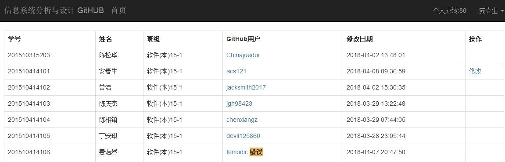

<!-- markdownlint-disable MD033-->
<!-- 禁止MD033类型的警告 https://www.npmjs.com/package/markdownlint -->

# 学生录入GitHUB用户名的系统

## 首页：

注意，GitHub用户要正确，不要出现上图中的“错误”文字。

## 修改用户信息

##查询个人成绩

注意，每次成绩要放到正确的地址中，不要出现图中的“错误地址”，否则会没有成绩。
## 搭建开发环境：
- Python 3.5
- 编辑器: IntelliJ IDEA 或者 Pycharm
- Python插件: flask,Bootstrap,cx_Oracle
- Oracle 12c

## 发布
- nohup python3 -u is_analysis_api.py > test.log 2>&1 &

